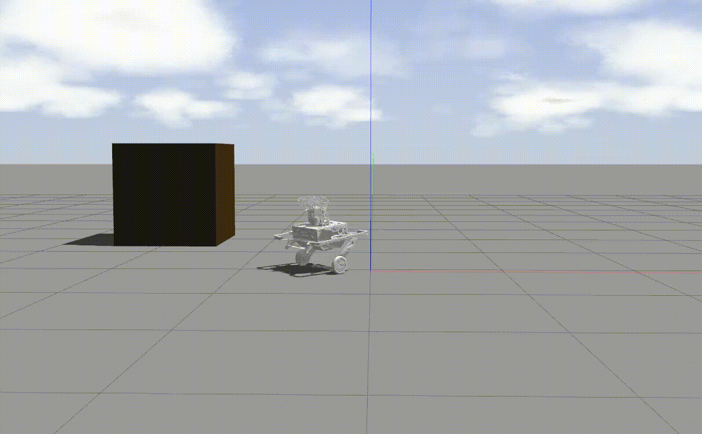
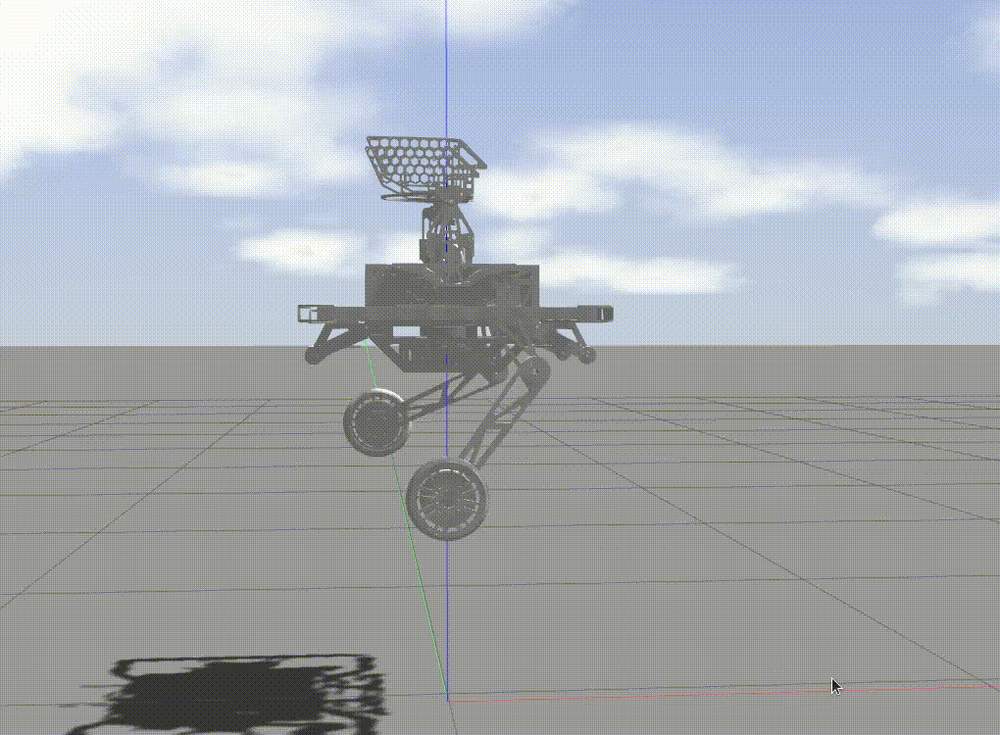

# Overview
An example of RL deployment for a wheel-legged robot, based on unitree_guide and Wheel-Legged-Gym. The control subject is a bipedal wheel-legged robot named "wl," with its joints driven by **Unitree A1 motors**.



# Quick Start

The following will quickly introduce the usage in the gazebo simulator. 
## Dependencies
1. [unitree_guide](https://github.com/unitreerobotics/unitree_guide)<br>
2. [unitree_ros](https://github.com/unitreerobotics/unitree_ros)<br>
3. [unitree_legged_msgs](https://github.com/unitreerobotics/unitree_ros_to_real)(Note that: unitree_legged_real package should not be a part of dependencies)<br>

Put these three packages in the src folder of a ROS workspace.

## build
Open a terminal and switch the directory to the ros workspace containing unitree_guide,  then run the following command to build the project:
```
catkin_make
```
If you have any error in this step, you can raise an issue to us.
## run
In the same terminal, run the following command step by step:
```
source ./devel/setup.bash
```
To open the gazebo simulator, run:
```
roslaunch unitree_guide gazeboSim.launch 
```

For starting the controller, open an another terminal and switch to the same directory,  then run the following command:
```
sudo ./devel/lib/unitree_guide/junior_ctrl
```

## usage
After starting the controller,  the robot will lie on the ground of the simulator, then press the '2' key on the keyboard to switch the robot's finite state machine (FSM) from **Passive**(initial state) to **FixedStand**,  then press the '4' key to switch the FSM from **FixedStand** to **WheelRlVmc**, now you can press the 'w' 'a' 's' 'd' key to control the translation of the robot. Back to **FixedStand**, press the '4' key to switch the FSM from **FixedStand** to **WheelVmcTest**. The **WheelVmcTest** is an FSM for testing the VMC.



## known Issues

When the speed in the observations is 0, the wheels still output speed, causing rotation. The solution is not yet known.

